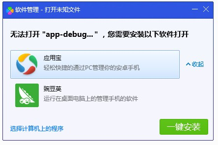
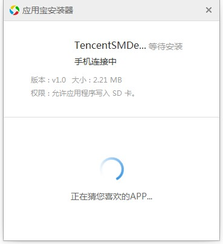
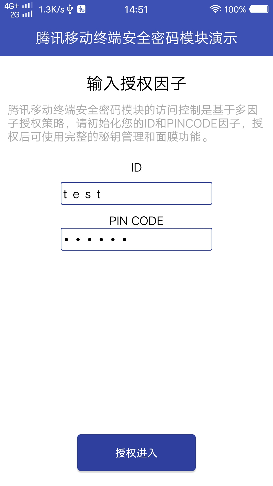
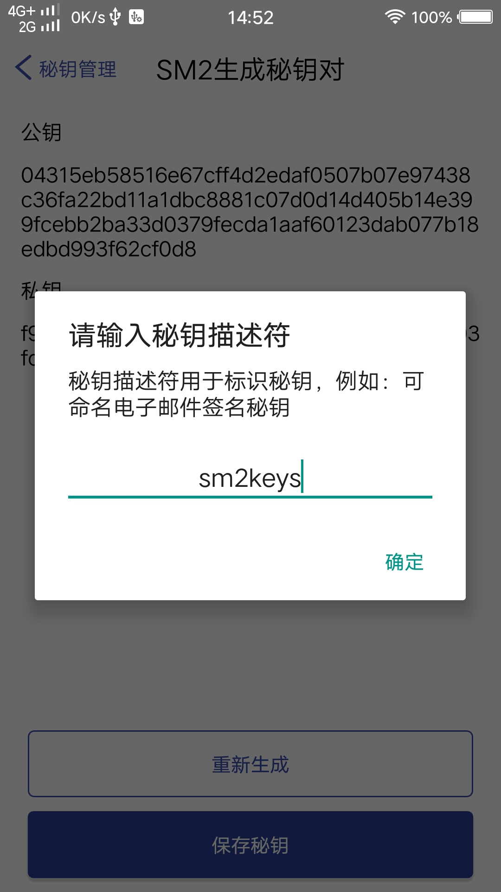
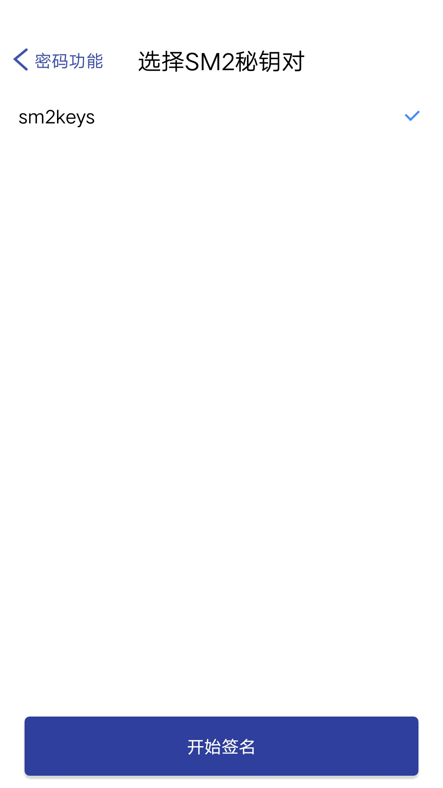
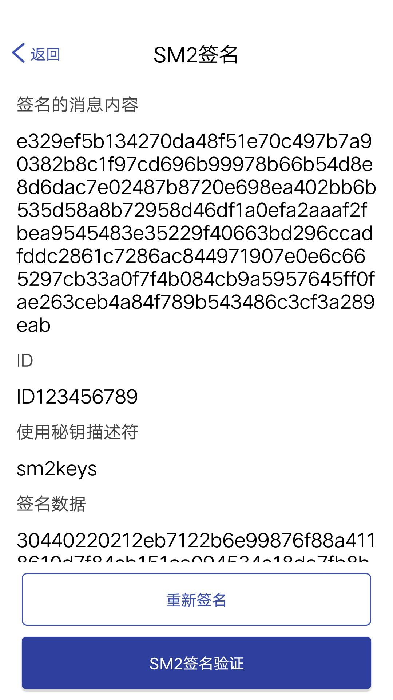

# 
腾讯智能移动终端安全密码模块 Demo使用说明

## Demo说明

腾讯智能移动终端安全密码模块（以下简称模块）为腾讯自研的符合国密算法标准的密码模块，通过接口调用可集成于移动端的app。该Demo目的在于通过简单的界面和交互演示模块所具备的功能，以及应用的场景。

## Demo安装

### 在iPhone上安装

> 第1步: 解压"腾讯智能移动终端安全密码模块.zip"文件后，进入Android目录的Demo子目录，可以看到文件"TencentSM.apk",这是一个debug签名的应用安装包文件。

> 第2步: 数据线连接您的Android手机到电脑，并信任该电脑。安装应用以应用宝为例，如果已安装腾讯电脑管家可以双击apk文件，出现对话框选择应用宝->一键安装，如图所示：
> 

> 第3步: 如果未安装腾讯电脑管家可以到https://sj.qq.com/下载PC版本应用宝安装。

> 第4步，双击apk文件出现应用宝安装应用对话框，等待安装完成！如图所示：

## Demo使用

该Demo的产品形态仅为腾讯智能移动终端安全密码模块的一个交互应用场景，以下简单介绍Demo的部分使用说明，其他更多功能的使用类似。

### 如何获得访问授权

腾讯智能移动终端安全密码模块的密钥管理接口具有访问控制能力，在模块初始化后，需要输入访问授权的ID和PinCode才能进行相应的密钥管理空间的访问。在首次使用时，可以自定义输入一组ID和PinCode，初始化以后，您获得了自己的密钥管理空间以及该空间下的权限。您可以生成、导入、导出以及销毁密钥，也可以进行SM2以及SM4的加解密调用。再次使用时，您如果要访问之前的密钥管理空间，必须输入与上次初始化所匹配的ID和PinCode。

如下图所示：

### 尝试生成一对非对称密钥

获得授权进入后，点击 密钥管理按钮，之后选择 生成密钥对，接下来点击 保存密钥。此时会有一个弹窗，您可以输入该密钥的描述符，您可以自定义为SignKey，以表示它的用途。输入描述符点击保存即可。

如下图所示：

### 尝试使用刚才的密钥对签名一条消息

退出到功能演示界面，选择密码功能按钮。
如下图所示：
选择SM2签名验签选项，并选择使用的密钥对。
如下图所示：
点击开始签名进入签名页面，在签名页面您也可以修改签名内容，并点击重新签名。
如下图所示：
